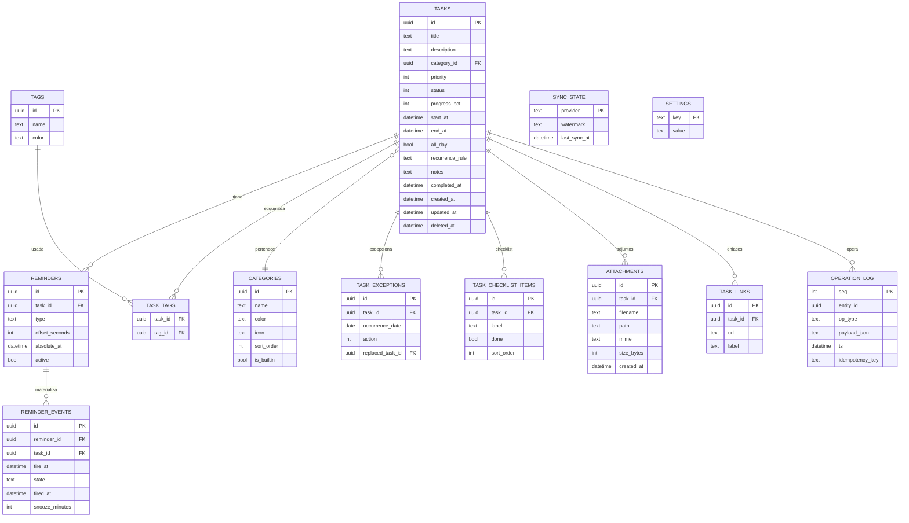

# 03 — Modelo de Datos

**Producto:** FocusFlow · **Versión:** v0.1 · **Fecha:** 2026-08-04
**Motor:** SQLite (WAL) · **Acceso:** solo desde el dominio Rust (ver doc 02 §4.2)

---

## 1. Diagrama entidad-relación



---

## 2. Definición de tablas

> Convenciones: UUID v7 como PK (ordenable por tiempo, apto para sync futuro). Timestamps en ISO 8601 con offset (`+00:00` o local), almacenados como texto o INTEGER epoch-ms — **decisión: INTEGER epoch ms UTC** para ordenar y comparar sin parsing. `deleted_at` implementa papelera (soft delete).

### 2.1 `tasks` — la entidad central

| Columna | Tipo | Restricción | Descripción |
|---------|------|-------------|-------------|
| `id` | TEXT (uuid7) | PK | |
| `title` | TEXT | NOT NULL, CHECK(trim≠'') | Título |
| `description` | TEXT | | Descripción larga |
| `category_id` | TEXT | FK → categories.id, ON DELETE SET NULL | Categoría (color+icono) |
| `priority` | INT | CHECK IN (0,1,2) | 0=Baja, 1=Media, 2=Alta |
| `status` | INT | CHECK IN (0,1,2,3) | 0=Pendiente, 1=En curso, 2=Completada, 3=Cancelada |
| `progress_pct` | INT | CHECK 0..100, DEFAULT 0 | % de progreso |
| `start_at` | INT | | Epoch ms UTC — inicio / deadline si `end_at` es NULL |
| `end_at` | INT | CHECK (end_at >= start_at OR end_at IS NULL) | Fin (bloque); NULL = deadline |
| `all_day` | INT | CHECK IN (0,1), DEFAULT 0 | Tarea de día completo |
| `recurrence_rule` | TEXT | NULL o RRULE válido (RFC 5545) | Repetición de la serie |
| `notes` | TEXT | | Notas (markdown ligero en V3) |
| `completed_at` | INT | | Timestamp de completado |
| `created_at` / `updated_at` | INT | NOT NULL | Auditoría y sync |
| `deleted_at` | INT | | Soft delete (papelera 30 días → purge real) |

**Reglas de negocio (validadas en dominio, no en BD):**
- `end_at < start_at` → rechazado (excepto transición de fecha de "todo el día" normalizada por dominio).
- Completar tarea no borra sus recordatorios pendientes; los cancela (estado `cancelled` en `reminder_events`).
- Tarea con `recurrence_rule`: `start_at` es la primera ocurrencia; las siguientes se expanden bajo demanda (nunca se materializan en `tasks`).
- Prioridad y estado no pueden ser NULL (defaults explícitos).

### 2.2 `categories` — categorías (color + icono)

| Columna | Tipo | Descripción |
|---------|------|-------------|
| `id` | TEXT (uuid7) | PK |
| `name` | TEXT | UNIQUE (case-insensitive) |
| `color` | TEXT | Hex `#RRGGBB` (token de categoría; se valida en paleta) |
| `icon` | TEXT | Nombre de icono Lucide (ej: `graduation-cap`) |
| `sort_order` | INT | Orden en sidebar |
| `is_builtin` | INT | 1 = creada en onboarding (Universidad, Trabajo, Personal, Salud, Finanzas, Otros) — no borrable si tiene tareas |

### 2.3 `tags` + `task_tags` — etiquetas N:M

| Tabla | Columnas |
|-------|----------|
| `tags` | `id` PK, `name` UNIQUE, `color` |
| `task_tags` | PK compuesta (`task_id`, `tag_id`), FK ambas con CASCADE; índice por `tag_id` para "todas las tareas con etiqueta X" |

### 2.4 `reminders` — definición de recordatorios

| Columna | Tipo | Descripción |
|---------|------|-------------|
| `id` | TEXT | PK |
| `task_id` | TEXT | FK → tasks, ON DELETE CASCADE |
| `type` | TEXT | CHECK IN ('relative','absolute','preset') |
| `offset_seconds` | INT | type=relative/preset: −86400 = 1 día antes; −10800 = 3 h; −3600 = 1 h; −900 = 15 min |
| `absolute_at` | INT | type=absolute: fecha/hora exacta |
| `active` | INT | DEFAULT 1 |

Nota: los predefinidos ("1 día antes", "3 h", "1 h", "15 min") se **materializan como filas** con `type='preset'` — el usuario puede mezclarlos libremente y la UI muestra toggles; sin jerarquía especial en el modelo.

### 2.5 `reminder_events` — motor de recordatorios (materialización)

| Columna | Tipo | Descripción |
|---------|------|-------------|
| `id` | TEXT | PK |
| `reminder_id` | TEXT | FK → reminders, CASCADE |
| `task_id` | TEXT | FK → tasks, CASCADE (denormalizado para consultas rápidas del scheduler) |
| `fire_at` | INT | Epoch ms — momento exacto de disparo **ya resuelto** (offset aplicado) |
| `state` | TEXT | CHECK IN ('pending','fired','snoozed','cancelled','missed') |
| `fired_at` | INT | Cuándo se disparó |
| `snooze_minutes` | INT | Si se pospuso (la UI recalcula un nuevo evento `snoozed` y cancela el actual) |

**Invariantes (dominio):**
- Un `reminder` activo tiene **exactamente un** `reminder_events` pendiente.
- Mover la tarea → el dominio elimina eventos pendientes y recrea (sin duplicados). Esto cumple FR-30 y es verificable en tests.
- `missed` = vencido mientras la app estaba cerrada → alimenta "Mientras no estabas" (FR-35).

### 2.6 `task_exceptions` — excepciones de series repetitivas

| Columna | Tipo | Descripción |
|---------|------|-------------|
| `id` | TEXT | PK |
| `task_id` | TEXT | FK → tasks, CASCADE (tarea *serie*) |
| `occurrence_date` | TEXT | Fecha de la ocurrencia afectada (AAAA-MM-DD) |
| `action` | INT | 0=omitir, 1=editar (→ `replaced_task_id`), 2=marcar completada sola |
| `replaced_task_id` | TEXT | NULL | FK → tasks: si la ocurrencia se editó, apunta a la tarea duplicada que la reemplaza |

Expansión: para una serie, la ocurrencia del día D se computa = serie + exceptions[D]. Completo/omito/edit solo esa instancia sin tocar el resto (FR-51).

### 2.7 `task_checklist_items` (V2)

| Columna | Tipo |
|---------|------|
| `id` PK, `task_id` FK CASCADE, `label` TEXT NOT NULL, `done` INT, `sort_order` INT |

### 2.8 `attachments` (P3) y `task_links`

- `attachments`: `id`, `task_id` FK, `filename`, `path` (relativa a carpeta de adjuntos validada contra traversal), `mime`, `size_bytes`, `created_at`.
- `task_links`: `id`, `task_id` FK, `url` (validada http/https), `label`.

### 2.9 `operation_log` — base de sync futura (doc 02 §6)

| Columna | Tipo | Descripción |
|---------|------|-------------|
| `seq` | INTEGER | PK AUTOINCREMENT (monótono) |
| `entity_id` | TEXT | Tarea/categoría afectada |
| `op_type` | TEXT | create / update / delete / complete / move |
| `payload_json` | TEXT | Delta serializado |
| `ts` | INT | Epoch ms |
| `idempotency_key` | TEXT | UUID de la operación (dedupe en sync) |

Escritura append-only desde el dominio. En MVP se usa para auditoría y undo; en V4 es el formato de delta sync.

### 2.10 `sync_state` (V4) y `settings`

- `sync_state`: `provider` PK (google/outlook/ical), `watermark`, `last_sync_at`.
- `settings`: key/value JSON (`theme`, `widget.*`, `hotkey`, `autostart`, `locale`, `reminder_defaults`).

---

## 3. Índices (estrategia)

Las consultas calientes son por **rango de fechas** (render de calendario/agenda) y por **estado+fecha** (listas y widget). Índices cubiertos para no tocar heap:

```sql
-- Render de calendario: cualquier vista consulta por ventana temporal
CREATE INDEX idx_tasks_start    ON tasks(start_at)        WHERE deleted_at IS NULL;
CREATE INDEX idx_tasks_end      ON tasks(end_at)          WHERE deleted_at IS NULL;
CREATE INDEX idx_tasks_cat      ON tasks(category_id)     WHERE deleted_at IS NULL;
CREATE INDEX idx_tasks_status   ON tasks(status, start_at);
CREATE INDEX idx_tasks_title    ON tasks(title COLLATE NOCASE);          -- búsqueda
CREATE INDEX idx_tasks_due      ON tasks(COALESCE(end_at, start_at));    -- agenda/vencidas

-- Scheduler: lo que falta por disparar
CREATE INDEX idx_events_fire    ON reminder_events(fire_at, state);

-- Etiquetas invertidas
CREATE INDEX idx_task_tags_tag  ON task_tags(tag_id);

-- Excepciones por serie
CREATE INDEX idx_exceptions_task ON task_exceptions(task_id);

-- Búsqueda full-text (V1 si "búsqueda rápida" lo exige; MVP: LIKE + índice COLLATE NOCASE)
-- ALTERNATIVA V2: tabla FTS5 tasks_fts(title, description, notes) sincronizada por trigger
```

**Decisión de búsqueda:** MVP con `LIKE '%…%'` sobre índice NOCASE + filtros (10k tareas es trivial). V2 migra a **FTS5** (sincronización por triggers en el dominio) para búsqueda con stemming y ranking sin cambiar la API.

**Partición lógica por tiempo:** no se particionan tablas; se consulta por rango. La regla de *purga*: papelera > 30 días se borra físicamente en mantenimiento semanal.

---

## 4. Migraciones y versionado

- Migraciones como archivos SQL versionados (`migrations/0001_init.sql`, `0002_fts5.sql`…), aplicadas al arranque en transacción con `PRAGMA user_version`.
- **Regla de inmutabilidad**: una migración aplicada nunca se edita; los cambios son nuevas migraciones. Previene R5 (doc 02).
- Antes de migrar: snapshot de backup automático (§5).
- `PRAGMA journal_mode=WAL` + `busy_timeout=2000` (las consultas del scheduler y de la UI comparten BD).

## 5. Backups y portabilidad

- Backup automático rotativo: copia WAL checkpointed a `backups/focusflow-YYYYMMDD.db` (retención 14 días), ejecutada al arranque o cada 24 h en reposo.
- Export/import JSON: serialización completa del esquema (con `schema_version`) → portabilidad total y puente de prueba.
- Export iCal: ocurrencias expandidas de ventanas de 6 meses, con UID estable = `task_id@focusflow` (idempotente al re-importar).
- Rutas: datos en `%APPDATA%\FocusFlow\` (BD, backups, adjuntos); ajustes en el mismo (settings). Sin archivos en carpeta de instalación.

## 6. Escalabilidad

| Escenario | Capacidad | Mecanismo |
|-----------|-----------|-----------|
| Tareas | 100 000 | Índices cubiertos, ventanas por rango, agenda virtualizada |
| Ocurrencias repetitivas | ∞ | Expansión bajo demanda, nunca materializada |
| Recordatorios | 10 000 pendientes | Índice `(fire_at, state)`; el scheduler solo toca el próximo |
| Fichero de BD | ~GB | WAL + checkpoint; datos de texto comprimibles (JSON en operation_log si crece) |
| Multi-dispositivo (V4) | N dispositivos | Operation log → delta sync; watermark por proveedor |
| Multi-usuario (V6) | — | Fuera de alcance; el modelo es single-user por diseño y el paso a multi-user es tema de sync+permisos, no de esquema local |
